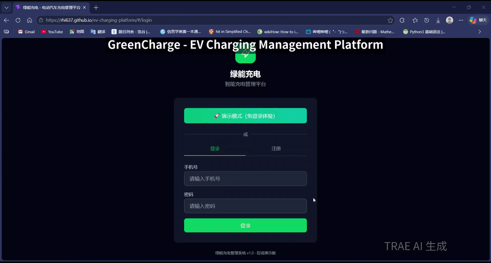

[](https://github.com/Rhi637/ev-charging-platform/stargazers) [](https://github.com/Rhi637/ev-charging-platform/fork) [](https://rhi637.github.io/ev-charging-platform/) [](https://github.com/Rhi637/ev-charging-platform/blob/main/LICENSE)
# ⚡ GreenCharge - EV Charging Management Platform

> A full-stack electric vehicle charging station management platform with AI-powered dispatching, V2G bidirectional charging, and Virtual Power Plant (VPP) aggregation.

[🌐 Live Demo](https://rhi637.github.io/ev-charging-platform/) · [▶️ YouTube](https://youtu.be/WXWEZkXSj6M) · [▶️ Bilibili](https://www.bilibili.com/video/BV1wGoMBiEcB/) · [中文文档](README_CN.md)


---

## 🌟 Overview

**GreenCharge** is an open-source EV charging management platform built with React 19 and Express.js. It covers the complete charging ecosystem — from station monitoring and user charging to financial settlement and AI-driven optimization.

Designed for charging station operators, fleet managers, and energy companies, GreenCharge explores cutting-edge directions including **AI Smart Dispatching**, **V2G (Vehicle-to-Grid)**, **Virtual Power Plants**, and **Charging Ecosystem Integration**.

---

## ✨ Features

### 📊 Operations Dashboard
- KPI cards with real-time metrics (revenue, active stations, utilization rate)
- Revenue trend charts (monthly/yearly)
- Station performance ranking table with sorting

### 🗺️ Station Monitoring
- Interactive map with real-time station status (React-Leaflet)
- Custom markers with color-coded status indicators
- Station detail modal with charging power curves
- WebSocket-powered live status updates

### 📈 Big Data Analytics
- Dark neon-themed analytics dashboard
- Charging heatmap (hour x day of week)
- User segmentation (high-frequency / regular / low-frequency / churned)
- Hourly session distribution analysis

### 🤖 AI Smart Dispatching
- 24-hour charging demand prediction (actual vs. AI predicted + confidence interval)
- Dynamic pricing model with 4 tiers (off-peak / normal / peak / super-peak)
- AI decision recommendation cards (peak shaving, fault warning, load balancing)
- Model performance monitoring (accuracy, recall, F1 score)

### 🔋 V2G Bidirectional Charging
- Bidirectional charging power curve visualization
- Interactive revenue calculator (battery capacity x discharge ratio x price spread)
- V2G station list with status monitoring

### ⚡ Virtual Power Plant (VPP)
- Grid interaction curves (generation / consumption / storage)
- Resource distribution doughnut chart (chargers / storage / solar)
- Revenue breakdown stacked bar chart

### 🏪 Charging + Ecosystem
- Business model cards (retail / dining / logistics)
- Partner network grid display
- Revenue composition analysis
- ROI investment return calculator

### 🏘️ County Expansion
- Market opportunity statistics
- Cost comparison: traditional vs. lightweight deployment
- Expansion timeline planning

### 👤 User Charging Portal
- Nearby station map search
- QR code scanning for charging
- Real-time charging monitoring (power, voltage, current, cost)
- Online payment simulation
- Charging reservation system

### 💰 Financial Settlement
- Split billing with adjustable ratio slider
- Monthly settlement table
- Revenue vs. expenditure dual-line trend chart

### 👥 User Management
- Search and filter users
- Account freeze/unfreeze
- Pagination support

---

## 🛠️ Tech Stack

| Layer | Technology |
|-------|-----------|
| Frontend | React 19 + Vite 8 |
| Routing | React Router v7 (HashRouter) |
| Styling | Tailwind CSS v4 |
| Charts | Chart.js + react-chartjs-2 |
| Maps | React-Leaflet + Leaflet |
| Real-time | Socket.IO (WebSocket) |
| Backend | Express.js |
| Database | SQLite (better-sqlite3, WAL mode) |
| Auth | JWT (jsonwebtoken + bcryptjs) |
| Deployment | GitHub Actions + GitHub Pages |

---

## 🚀 Quick Start

### Prerequisites
- Node.js >= 18
- npm >= 9

### Installation

```bash
git clone https://github.com/Rhi637/ev-charging-platform.git
cd ev-charging-platform
npm install
npm run dev:all
```

- Frontend: http://localhost:5173
- Backend API: http://localhost:3001

### Demo Mode

The live demo runs in **demo mode** — click the "🚀 Demo Mode" button on the login page to explore all features without a backend.

---

## 📁 Project Structure

```
ev-admin/
├── server/                    # Backend services
│   ├── index.js               # Express entry + Socket.IO setup
│   ├── config/                # Database & app configuration
│   ├── models/                # Data models & initialization
│   ├── routes/                # API routes (7 modules, 30+ endpoints)
│   ├── middleware/             # JWT authentication middleware
│   ├── websocket/             # WebSocket real-time communication
│   └── utils/                 # Utility functions
├── src/                       # Frontend source
│   ├── components/            # Shared components (Layout, Sidebar)
│   ├── context/               # React Context (Theme, Auth)
│   ├── pages/                 # Page components (12 pages)
│   ├── services/              # API service layer + Socket.IO client
│   ├── data/                  # Mock data
│   └── utils/                 # Chart setup, status badges
├── .github/workflows/         # GitHub Actions CI/CD
├── index.html
├── vite.config.js
└── package.json
```

---

## 🎨 Design Highlights

- **Glassmorphism UI** — Frosted glass cards with neon accents on dark background
- **Dark / Light Theme** — Global responsive theme switching
- **Responsive Design** — Desktop and mobile friendly
- **Accessibility** — ARIA labels, keyboard navigation, prefers-reduced-motion support
- **Real-time Updates** — WebSocket-powered station status and charging progress

---

## 🌐 Deployment

### Frontend (GitHub Pages)

Automatically deployed via GitHub Actions on every push to main branch.

Live demo: https://rhi637.github.io/ev-charging-platform/

### Backend (Cloud Server)

```bash
npm install -g pm2
pm2 start server/index.js --name greencharge-api
```

---

## 📊 Backend API Overview

| Module | Endpoints | Description |
|--------|-----------|-------------|
| Auth | 4 | Register, login, profile, update |
| Stations | 3 | List, detail, status update |
| Sessions | 4 | Start, stop, history, active |
| Payments | 3 | Create, confirm, history |
| Reservations | 3 | Create, cancel, list |
| Stats | 2 | Overview, revenue trends |
| Users | 3 | List, freeze, unfreeze |

**Total: 22 RESTful endpoints** + WebSocket events for real-time updates.

---

## 🤝 Contributing

Contributions are welcome!

1. Fork the repository
2. Create your feature branch
3. Commit your changes
4. Push to the branch
5. Open a Pull Request

---

## 📄 License

[Apache License 2.0](LICENSE) — free for personal and commercial use.

---

## 📮 Links

- 🌐 **Live Demo**: https://rhi637.github.io/ev-charging-platform/
- 📂 **Repository**: https://github.com/Rhi637/ev-charging-platform
- 🐛 **Issues**: https://github.com/Rhi637/ev-charging-platform/issues

---

If you find this project helpful, please consider giving it a ⭐ star!
